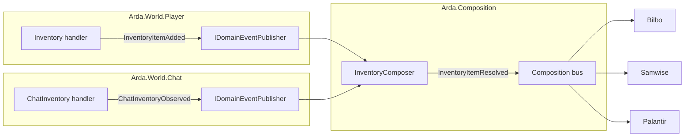

# Dispatch & Composition

Companion to [`simulator-design.md`](simulator-design.md). That doc defines frames, the world's input/internal pipes, and the suggested state-machine catalogue. This doc covers the architectural commitments that surround it: the layer invariant the worlds live inside, how envelopes route to state machines, how diagnostic/test consumers attach without violating that routing, how state-machine boundaries get drawn, and what composes across worlds.

## Layer invariant

The pipeline from log file to module spans five layers. L0 through L3 are **single-output** (one input produces at most one output to the next layer); L4 is genuine **fan-out** (one input may produce many outputs, by data).

| Layer | Component | Shape | Output |
|---|---|---|---|
| L0 | Log Source (tailer + clock) | linear | line boundaries in a pooled char buffer; clock stamps timestamp + consumed prefix length per line span |
| L1 | Classifier + splitter | linear | one classified envelope per recognized line; stamps `IsReplay`; discards noise at zero alloc cost (span never promoted to string) |
| L2 | Log stream driver | linear (per world) | one envelope to one subscriber per envelope-kind |
| L3 | Dispatch + state machine | linear | verb extracted on span; `FrozenDictionary` alternate-key lookup routes to handler(s); frame deserialized from span only when handler exists |
| L4 | Domain events on `world.out` → composers / views / modules | fan-out | many subscribers per event, empirically |

The fan-out at L4 is justified by data: today, multiple modules subscribe to the same change events (e.g., inventory mutations consumed by both Bilbo and Samwise; calendar ticks consumed by Gandalf and the moon-phase producer). L0–L3 are linear because each layer's job is discrimination + transformation, not distribution; broadcasting at those layers would pay capacity for cross-handler coupling that no current data justifies.

L4 has two roles:

- **Shared composers** (`Arda.Composition`) — subscribe to domain events from one or more worlds, produce new composed events consumed by other L4 participants. Multi-consumer by definition.
- **Terminal consumers** (modules) — subscribe to L3 domain events and/or shared composer events, produce UI state. Never emit events that other L4 participants consume.

**No-back-edge rule:** Terminal consumers never feed back into the event bus. Shared composers never depend on module state. Dependency flows one direction: modules → shared composers → worlds.

**Placement rule:** `Arda.Composition` hosts composers whose output serves multiple modules (N>1 real subscribers). A composer with a single consumer belongs in that module — the module is itself an L4 terminal consumer and can subscribe to domain events from both worlds directly. Extract to `Arda.Composition` only when a second consumer materialises.

If a future layer is introduced above L4, this invariant guides where it sits: fan-out earns its keep only when N>1 real subscribers exist.

## Verb-keyed dispatch at L3

`simulator-design.md` step 8 reads "for every state machine in the world, the frame is passed." That's the broadcast shape. We **refine it to verb-keyed routing**: each state machine declares the frame types it handles, and the dispatch loop routes each frame to the registered handler list for that type.

Properties:

- **O(1) lookup**, not O(N) per-frame broadcast. Verb → handler list is a single `FrozenDictionary` lookup. Uses `GetAlternateLookup<ReadOnlySpan<char>>()` so the verb extracted from the line span routes to its handler list without allocating a string for the key.
- **Multiple handlers per frame type are expected.** Some verbs are legitimately consumed by more than one world-fact (e.g., `ProcessDeleteItem` is consumed by both Inventory and NPC interaction). Registration order is the dispatch order within a type — owned by a static extension method so it's auditable in one place.
- **Frames are immutable.** Every handler in the list receives the same frame. No handler mutates what the next handler sees; no side-channel between handlers on `world.px`.
- **"No handler for verb X" is observable.** A frame arriving with an empty handler list is a first-class diagnostic (versus "N SMs silently returned null"), surfacing log-grammar drift early. No string allocation occurs for unhandled verbs — the span is inspected and discarded.
- **No re-entry.** `world.out` is sealed output — nothing on `world.px` reads from it. Combined with frame immutability, this eliminates message storms by construction: no back-edge, no shared mutable state, no mutation channel between handlers.
- **Span-based deserialization.** The handler (transform) receives the envelope's line content as a span. It tokenizes arguments positionally (scan for `,`, `(`, `)`) on the span, calling `.ToString()` only for values it needs to persist in state machine state. String interning against reference data POCOs reduces allocations further for known identifiers.

## Observer surface

Verb-keyed canonical dispatch at L3 doesn't preclude multi-subscriber instrumentation; observers are a separate channel from canonical handlers. Naming this explicitly so a future reader sees that diagnostic / test / replay tooling can coexist with the L0–L3 linear invariant without violating it.

**Contract on observers:**

1. **Non-mutating.** An observer must not write to anything the canonical handler reads. Violating this re-introduces cross-handler coupling via the side channel — exactly what verb-keyed dispatch was designed to prevent.
2. **No claim semantics.** Observers don't suppress the canonical handler or alter the produced frame.
3. **Ordering by registration**, deterministic.

**Two natural placement points** in the dispatch loop:

- **Pre-canonical-dispatch observers** see the raw envelope before verb routing. For "I want to know every envelope arrived, regardless of whether it produced a frame" — perf tracers, test-harness recorders, envelope-frequency analysers.
- **Post-canonical-dispatch observers** see `(envelope, optional emitted frame, optional change events produced)`. For outcome-focused instrumentation — dispatch-outcome logs, "envelope X produced frame Y" traces.

**Where this lands relative to today's code.** The ad-hoc `IDiagnosticsSink.Info(...)` calls scattered through current producers are doing this in per-producer form. Lifting them into a first-class observer surface is strictly cleaner: diag is per-envelope-and-per-dispatch-step (not per-producer); test/replay tooling stops having to plug into N transforms to capture everything; the observer surface is uniform across all envelopes. A natural follow-on, not a blocker.

## World-fact decomposition

State machines are decomposed by **world-fact**, not by output event. The unit of ownership is a coherent thing in the game world; the unit of communication is whatever events that thing produces.

Worked example — **NPC interaction**. A single interaction with an NPC may yield multiple distinct outcomes from the same envelope sequence: gift accepted, gift declined, vendor sale, conversation completed. The temptation is to give each outcome its own state machine (`IGiftSignalService`, `IVendorSaleService`, …) because each consumer wants a different event. That decomposition splits ownership of one world fact (the NPC interaction context) across N state machines that must each reconstruct the same context independently.

The correct decomposition: one `INpcInteractionStateMachine` owns the interaction context and emits all of its outcome events. Consumers subscribe to whichever events they care about. The state machine's surface is a typed event channel, not one interface per outcome.

This generalises: when two services duplicate context-tracking logic to emit different events from the same envelope sequence, fold them into one SM keyed on the world fact.

Note: the world-fact rule determines **SM boundaries**, not dispatch exclusivity. Two SMs owning different world-facts may both register for the same frame type (e.g., Inventory and NPC both handle `ProcessDeleteItem`). The rule says "don't split one world-fact across multiple SMs" — it does not say "each frame type belongs to one SM."

## Ownership boundary: Arda vs. modules

**Arda owns interpretation of multi-consumer world-facts. Modules own interpretation of single-consumer domain logic.**

The distinguishing question: "does more than one consumer need the *interpreted* output?" If yes, Arda owns the SM and emits semantic domain events. If no, Arda emits the deserialized frame verbatim on `world.out` and the module runs its own SM.

| World-fact | Consumers | Owner |
|---|---|---|
| Inventory state (Player.log) | Bilbo, Samwise, Arwen, Smaug, Palantir | Arda — `Inventory` in `Arda.World.Player` |
| Inventory observations (Chat) | Bilbo, Samwise, Palantir (via L4 composer) | Arda — `ChatInventory` in `Arda.World.Chat` |
| NPC interaction context + vendor purse | Arwen, Smaug | Arda — `Npc` in `Arda.World.Player` |
| Skills / Recipes | Elrond, Samwise, Celebrimbor | Arda — `Player` in `Arda.World.Player` |
| Map / Area | Legolas, Gandalf, Samwise | Arda — `Map` in `Arda.World.Player` |
| Calendar / Time-of-day | Gandalf, Samwise | Arda — `Calendar` in `Arda.World.Player` |
| Chat session identity | SessionAgreement, InventoryView, WoPView | Arda — `ChatSession` in `Arda.World.Chat` |
| Player chat messages | Saruman (WoP, module-internal composition), Arwen (future) | Arda — `ChatLine` in `Arda.World.Chat` (Tier 2) |
| Gardening plot state | Samwise only | Module-owned (Tier 2 passthrough) |
| Survey route state | Legolas only | Module-owned (Tier 2 passthrough) |

**Consequence for modules:** A module's log parser dies. Its state machine stays but its input type changes from "raw log line I regex-match myself" to "typed event from `world.out`." All log-grammar knowledge (timestamp formats, positional argument parsing, rotation handling) stays inside Arda. Modules are insulated from log format changes.

**Migration complete:** The legacy `IPlayerLogStream` / `IChatLogStream` / `ILogStreamDriver` pipeline has been retired. All modules consume Arda domain events exclusively. The legacy pipeline's health signaling (`LogStreamAttentionSource`) has been replaced by `IWorldHealthView` in `Arda.Contracts`.

**Tailer liveness — `IIngestPulse` (infra, not a domain event):** `WorldHealth.Drift` is the wall-clock age of the tailer's last poll iteration, NOT the age of the last in-stream log timestamp (#856). The signal is exposed via `IIngestPulse` in `Arda.Hosting` (read-side) and recorded by ingest poll loops via `IIngestPulseSink` in `Arda.Abstractions` (write-side, placed there so `Arda.Ingest` doesn't reference `Arda.Hosting`). The same singleton implements both. `WorldMode.Stalled` is a first-class state — "was Live, pulse has gone silent past `DriftWarningThreshold` (5s)" — distinct from `Halted` (grammar break) and `Replaying` (catching up). Critically, the pulse is NOT a domain event on `IDomainEventBus`: the bus's vocabulary stays game-domain events only. `IIngestPulse` parallels `IReplayProgress` as infra.

## State handler catalogue

Arda state handlers are named by their domain (`Map`, `Inventory`, `Npc`, `Player`, `Calendar`, `ChatInventory`, `ChatSession`, `ChatLine`). No suffix — the handler IS the state owner. Each handler implements `IFrameHandler`, receives verb dispatches, owns mutable state, and emits domain events via `IDomainEventPublisher`.

### Player source — `Arda.World.Player`

#### Tier 1 — State-owning handlers (multi-consumer)

| Handler | Verbs | State owned | Events emitted |
|---|---|---|---|
| `Map` | `LOADING_LEVEL`, `InitializingArea` | Current area key (interned) | `AreaChanged` |
| `Inventory` | `ProcessAddItem`, `ProcessDeleteItem`, `ProcessUpdateItemCode` | Instance-keyed item set | `InventoryItemAdded`, `InventoryItemRemoved`, `InventoryItemUpdated` |
| `Player` | `ProcessLoadSkills`, `ProcessUpdateSkill`, `ProcessLoadRecipes`, `ProcessUpdateRecipe` | Skill levels, recipe set | `SkillsLoaded`, `SkillUpdated`, `RecipesLoaded`, `RecipeUpdated` |
| `Npc` | `ProcessStartInteraction`, correlated `ProcessDeleteItem`, `ProcessDeltaFavor`, `ProcessVendorScreen`, `ProcessVendorAddItem` | Interaction context, favor, vendor session (NPC key + favor tier) | `InteractionStarted`, `GiftAccepted`, `VendorScreenOpened`, `VendorItemSold` |
| `Session` | `ProcessAddPlayer` | Character name, login timestamp | `SessionStarted` |
| `Weather` | `ProcessSetWeather` | Current condition | `WeatherChanged` |
| `Celestial` | `ProcessSetCelestialInfo` | Sun/moon angles, time-of-day | `CelestialInfoChanged` |
| `Effects` | `ProcessAddEffects`, `ProcessRemoveEffects`, `ProcessUpdateEffectName` | Catalog-id-keyed active set with instance-to-catalog bridging | `EffectsAdded`, `EffectsRemoved`, `EffectNameUpdated` |
| `Position` | `ProcessNewPosition`, `ProcessAddPlayer` | X/Y/Z, measurement source | `PlayerPositionChanged` |
| `Quest` | `ProcessBook`, `ProcessLoadQuests`, `ProcessCompleteQuest` | Active quest set | `QuestsLoaded`, `QuestAccepted`, `QuestCompleted`, `QuestOffered` |
| `MapPins` | `ProcessMapPinAdd`, `ProcessMapPinRemove` | Pin collection per area | `MapPinAdded`, `MapPinRemoved` |
| `Vault` | `ProcessShowStorageVault`, `ProcessAddToStorageVault`, `ProcessRemoveFromStorageVault`, correlated `ProcessAddItem` / `ProcessDeleteItem` | Open vault session (entity, storage id), pending add/delete for same-tick pairing | `VaultOpened`, `VaultDeposit`, `VaultWithdrawal` |
| `Calendar` | (line observer — derived from timestamps on every line) | Wall-clock, time-of-day shift state | `CalendarTimeAdvanced`, `TimeOfDayShifted` |

`IMapState` is a composite projection over `Map` + `Position` + `Weather` + `MapPins` (the `MapScope` adapter in `Arda.World.Player.Internal`), not its own handler. Consumers that want the four area-scoped facts as one read interface inject `IMapState`; the underlying handlers each own their slice.

#### Tier 2 — Passthrough and single-verb handlers

| Handler | Verbs | Events emitted | Primary consumer |
|---|---|---|---|
| `UpdateDescriptionHandler` | `ProcessUpdateDescription` | `UpdateDescriptionFrame` | Samwise |
| `SetPetOwnerHandler` | `ProcessSetPetOwner` | `SetPetOwnerFrame` | Samwise |
| `ProcessBookHandler` | `ProcessBook` | `BookOpened`, `FoodsConsumedReport`, `WordOfPowerDiscovered` | Pippin, Saruman |
| `ScreenTextHandler` | `ProcessScreenText` | `ScreenTextObserved`, `ScreenTextErrorFrame` | Samwise |
| `ErrorMessageHandler` | `ProcessErrorMessage` | `PlantingCapFrame` | Samwise |
| `TalkScreenHandler` | `ProcessTalkScreen` | `TalkScreenFrame` | Arwen |
| `EndInteractionHandler` | `ProcessEndInteraction` | `InteractionEnded` | Arwen, Samwise |
| `DelayLoopHandler` | `ProcessDoDelayLoop` | `DelayLoopStarted` | Samwise |
| `WaitInteractionHandler` | `ProcessWaitInteraction` | `InteractionWaiting` | Samwise |
| `EnableInteractorsHandler` | `ProcessEnableInteractors` | `EnableInteractorsFrame` | Samwise |
| `VendorGoldHandler` | `ProcessVendorUpdateAvailableGold` | `VendorGoldUpdated` | Arwen |
| `MapFxHandler` | `ProcessMapFx` | `MapFxObserved` | Legolas |
| `AppearanceObserver` | (line observer — `Download appearance loop` pattern) | `AppearanceLoopFrame` | Samwise |

There is also a `StateResetHandler` registered for `LOADING_LEVEL` that resets the mutable state of every Tier 1 handler whose facts are zone-scoped (inventory, npc interaction, vault, weather, celestial, map pins, position, effects, session, player skills/recipes). It owns no state and emits no events — it is a fan-out reset. **Handler order for `LOADING_LEVEL` is load-bearing**: `Map` runs first (so the new `CurrentArea` is set), then `StateResetHandler` (so downstream resets see the new area, not the stale one). The `DispatchTable` preserves insertion order within a verb's handler list; `PlayerWorldExtensions.AddPlayerWorld()` is the auditable single point of order.

### Chat source — `Arda.World.Chat`

| Handler | Pattern | Events emitted |
|---|---|---|
| `ChatInventory` | `[Status] X [xN] added to inventory.` | `ChatInventoryObserved` |
| `ChatSession` | `**** Logged In As <char>. Server <server>. Timezone Offset <off>.` | `ChatSessionIdentified` |
| `ChatLine` | `[Channel] Speaker: text` (Tier 2 passthrough) | `PlayerChatLine` |

### Composition — `Arda.Composition`

| Composer | Subscribes to | Events emitted |
|---|---|---|
| `SessionComposer` | `SessionStarted`, `ChatSessionIdentified` | `SessionEstablished` |
| `InventoryComposer` | `InventoryItemAdded`, `ChatInventoryObserved` | `InventoryItemResolved` |
| `NpcStateComposer` | `GiftAccepted`, `VendorGoldUpdated`, … | `NpcStateChanged` |
| `PlayerProgressionComposer` | `SkillsLoaded`, `SkillUpdated`, `RecipesLoaded`, `RecipeUpdated` | `SkillProgressionChanged` |

### Naming convention

Two naming patterns coexist, distinguished by whether the handler owns state:

- **State-owning handlers** (Tier 1, multi-verb): Named by the world-fact they own — `Map`, `Inventory`, `Session`, `Effects`, `Position`, etc. No suffix. The class IS the handler AND the state owner; these concerns are not separable in the Arda dispatch model.
- **Single-verb action handlers** (Tier 2, thin adapters): Named by verb action with a `Handler` suffix — `AddItemHandler`, `DeleteItemHandler`, `TalkScreenHandler`, etc. These implement `IFrameHandler` directly, carry no state, and either delegate to a state owner or emit a passthrough event.

Neither pattern uses `SM`, `Tracker`, `Service`, or `State` suffixes.

### Project structure

```
Arda.World.Player/     — Player-source handlers + state + Tier 1 event structs
Arda.World.Chat/       — Chat-source handlers + state + event structs
Arda.Composition/      — L4 cross-source composers (subscribes to both buses)
```

Each library references `Arda.Dispatch` (for `IFrameHandler`, `ArgTokenizer`, `InternPool`) and `Arda.Contracts` (for `IDomainEventPublisher` / `IDomainEventSubscriber`) and exposes a registration extension method:

```csharp
services
    .AddArda(new ArdaOptions(logDir))
    .AddPlayerWorld()          // Arda.World.Player
    .AddChatWorld()            // Arda.World.Chat
    .AddArdaComposition();     // Arda.Composition
```

## Chat verb extraction

Chat lines use a different grammar from Player.log. The `VerbExtractor` (monolithic, in `Arda.Dispatch`) is extended with chat-aware patterns:

| Chat pattern | Synthetic verb key | Handler |
|---|---|---|
| `[Status] ... added to inventory.` | `STATUS_INVENTORY` | `ChatInventory` |
| `**** Logged In As ...` | `CHAT_LOGIN_BANNER` | `ChatSession` |
| `[Channel] Speaker: ...` | `CHAT_PLAYER_LINE` | `ChatLine` |

Both the Player driver and Chat driver dispatch through the same shared `DispatchTable`. Verb namespaces are naturally disjoint (Player verbs start with `Process*` or are system-line synthetic keys; Chat verbs start with `STATUS_*`, `CHAT_*`). No risk of collision.

## Event allocation strategy

Domain events on `world.out` follow a two-tier allocation model that preserves the zero-alloc discipline established at L0/L1:

**Tier 1 — Interpreted events** (from Arda-owned SMs, multi-consumer):
- Numeric fields → parsed to `int`/`long`/`double` directly from span. Zero allocation.
- Known identifiers (`npcKey`, `skillType`, `internalName`, `areaKey`) → interned via `FrozenDictionary.GetAlternateLookup<ReadOnlySpan<char>>()` against reference data POCOs. Returns existing `string` instance. Zero allocation.
- Struct-typed events (value types, stack-allocated). No heap pressure from the event envelope itself.

**Tier 2 — Passthrough frames** (verbatim frame emitted for single-consumer modules):
- Numeric fields → same as Tier 1.
- Free-text fields (`title`, `description`, `action`) → `ReadOnlyMemory<char>` slices into the source `LogLine.Log` string. Zero allocation at the Arda boundary.
- The module pays for `.ToString()` only if it needs owned lifetime (storing a value in its own SM state). Arda never allocates strings that only one consumer will ever read.

**Allocation boundary principle:** The L0/L1 span-based pipeline pays one `string` allocation per promoted line (`LogLine.Log`). L3 frame deserialization adds zero or near-zero additional allocations for the common case (numeric + interned fields). Only genuinely unique free-text that a consumer decides to persist triggers a fresh string allocation, and that cost is borne by the consumer, not the pipeline.

## Composition pipeline

`world.out` is the world's external bus — domain events for everyone outside the world boundary. Conceptually each world has its own (PlayerWorld's `world.out` and ChatWorld's `chatout`) and the composition pipeline (`comp.in`) is a third channel that subscribes to both and republishes composed events.

**In the current build, all three logical pipes share one `DomainEventBus` singleton.** PlayerWorld handlers, ChatWorld handlers, and `Arda.Composition` composers all publish onto the same instance; subscribers read from the same instance. The three-pipe separation in this doc is a *layering model*, not a runtime structure. The unification is safe today because event types are disjoint by source (Player events live under `Arda.Contracts.Events.Player`, Chat events under `Arda.Contracts.Events.Chat`, composition events under `Arda.Contracts.Events.Composition`) and the bus is type-keyed — a subscriber that names `ChatInventoryObserved` cannot receive a Player event by accident.

What the unified-bus build gives up vs. the three-pipe model:

- **No-back-edge becomes a convention, not a structural guarantee.** Nothing in the type system prevents a module from publishing onto the bus the composers read from. The rule is enforced by review, not by separate channels.
- **"Worlds remain closed under their own log source"** is similarly convention-enforced. A Player handler subscribing to a Chat event would compile; the discipline is that it does not.
- **Composer output and world output share a channel.** A subscriber cannot tell from the bus alone whether `InventoryItemResolved` came from an L3 handler or an L4 composer — only the type identifies it.

If a back-edge or cross-source coupling regression surfaces in practice, the cheapest split is into three marker interfaces (`IPlayerEventBus`, `IChatEventBus`, `ICompositionEventBus`) backed by the same singleton, so injection sites name which pipe they participate in. Until then, the single bus is the build's reality and the three-pipe vocabulary below is the conceptual framing.

**Cross-world composition** lives in the **composition pipeline** (`comp.in`). The pipeline subscribes to the worlds' output buses and emits composed events on its own bus. Views and modules that need facts from multiple worlds attach there.

What's in scope for the composition pipeline:

- **Cross-world fusion only.** PlayerWorld events + ChatWorld events.
- **Worlds remain closed** under their own log source. The composition pipeline is the only place cross-source composition is allowed.
- **Correlation is timestamp-based.** Each log family has its own internal ordering (used only for resumption inside the source coordinator). There is no shared sequence space across families. Cross-world correlation uses `LogLineMetadata.Timestamp` for semantic matching and `LogLineMetadata.ReadOn` (monotonic batch-capture instant) for sub-second tiebreaking when events from both worlds were captured in the same poll cycle.

### Worked example: InventoryComposer

The game reports inventory additions through two independent log sources:

1. **Player.log** — `ProcessAddItem(GoblinCap(84741837), -1, False)` → `Inventory` handler emits `InventoryItemAdded(instanceId: 84741837, internalName: "GoblinCap", slot: -1)`
2. **Chat log** — `[Status] Goblin Cap x1 added to inventory.` → `ChatInventory` handler emits `ChatInventoryObserved(displayName: "Goblin Cap", count: 1)`

Neither source alone has the full picture (Player.log knows instance ID + internal name; Chat knows display name + stack count). The `InventoryComposer` in `Arda.Composition` subscribes to both event types and correlates them:



Correlation uses the `PendingCorrelator<TKey, TReq>` pattern (Tier 1 from [cross-source-correlation.md](../cross-source-correlation.md)): match on timestamp proximity within the same poll cycle (`ReadOn`-based tiebreaking). The composed event carries the full picture:

```csharp
readonly record struct InventoryItemResolved(
    long InstanceId,
    string InternalName,   // interned
    string DisplayName,    // from chat observation
    int Count,
    LogLineMetadata Metadata);
```

Modules subscribe to `InventoryItemResolved` on the composition bus — they never need to understand the raw log grammar or correlate across sources themselves.

What's **not** in scope:

- **Reference data** (items / recipes / skills / NPCs JSON). Schema, accessible from anywhere, no closure concern. State machines and views read it directly.
- **Reports and calibration** (character exports, surveyor calibration data, etc.). Mithril infrastructure consumed by modules. The worlds have no role with them; the composition pipeline doesn't either. Module-side composition pulls from `comp.in` + reports as needed.

Note: the composition pipeline also hosts persistent composers that serve N>1 consumers from a **single** world source (e.g. `PlayerProgressionComposer` provides enriched skill/recipe state from the player world). The placement rule still applies — the composer lives here because multiple modules need the same derived view, not because it fuses cross-world data.

## Composer convention

L4 composers in `Arda.Composition` are converging on a shared shape. Document the pattern here; promote to a base type only when a fourth or fifth composer lands and boilerplate is real.

### Public surface

Every composer exposes:

| Channel | Shape | Purpose |
|---|---|---|
| **Query** | `IReadOnlyDictionary<TKey, TEntry>` property | Point lookups and snapshot iteration |
| **React** | Domain events on `IDomainEventSubscriber` and/or a coarse `event EventHandler? Changed` | Notify consumers of mutations |

No **Bind** channel (observable collection, `INotifyPropertyChanged` per-row, `ItemsSyncRoot`). Composers live in `Arda.Composition` which has no WPF dependency. Modules that need WPF binding build their own `ObservableCollection` from the Query snapshot + React events — the module-side adapter pattern (Palantir's `LiveInventoryViewModel` is the current example). A shared adapter in `Mithril.Shared.Wpf` is deferred until multiple modules bind to the same composer's collection simultaneously.

### Persistence

Composers are either **ephemeral** (rebuilt from log replay each session) or **persistent** (backed by Mithril's per-character JSON store, accumulating knowledge across sessions).

- **Ephemeral** suits facts that are fully reconstructable from the current session's log (session identity, position, area). `SessionComposer` is ephemeral.
- **Persistent** suits facts that accumulate across sessions and would be lost on log rotation (inventory history, word-of-power codebook). The composer seeds from the per-character store on startup and writes back on mutation, using `PerCharacterModuleStore<T>` or equivalent.

### Current composers

| Composer | Key | Entry | Persistent | Notes |
|---|---|---|---|---|
| `SessionComposer` | — | `ComposedSession` | No | Fuses `SessionStarted` + `ChatSessionIdentified` |
| `InventoryComposer` | instanceId | `AccumulatedItem` | **Yes** | Fuses player inventory + chat observations; persists via `PerCharacterStore<AccumulatorSnapshot>` for soft-deleted item lookups |
| `PlayerProgressionComposer` | skillKey / recipeName | `EnrichedSkill` / `int` | **Yes** | Tracks live skill + recipe state; persists via `PerCharacterStore<ProgressionSnapshot>` for cold-start availability |
| `NpcStateComposer` | npcKey | `NpcRecord` | **Yes** | Accumulates per-NPC favor, favor tier, vendor gold, and gold-reset time; persists via `PerCharacterStore<NpcStateSnapshot>` |

`WordOfPowerComposer` was previously listed here. It had a single consumer (Saruman) and was moved to the module per the placement rule above. The module subscribes to `WordOfPowerDiscovered` + `PlayerChatLine` directly and owns its own `PerCharacterView` for persistence (`SarumanCodebookService`).

## Cross-references

- [`log-source.md`](log-source.md) — L0 / L1 detail (log files, rotation, envelope shape, `LogLineMetadata`, `IsReplay` stamp).
- [`l3-dispatch.md`](l3-dispatch.md) — L2/L3 implementation design: world driver loop, verb extraction, handler registry, `ArgTokenizer`, `InternPool`, passthrough vs interpreted events, Arda.Hosting startup model.
- [`simulator-design.md`](simulator-design.md) — frames, world pipes (`world.in` / `world.px` / `world.out`), suggested state machines.
- [`../../world-sim-single-source-rethink.md`](../../world-sim-single-source-rethink.md) — historical design notebook: argument that landed us at direct dispatch (vs the merger pattern). Largely superseded by these arda/ docs; kept as rationale trail.
