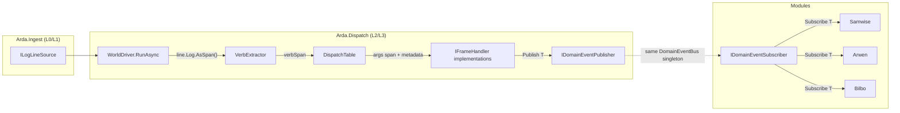
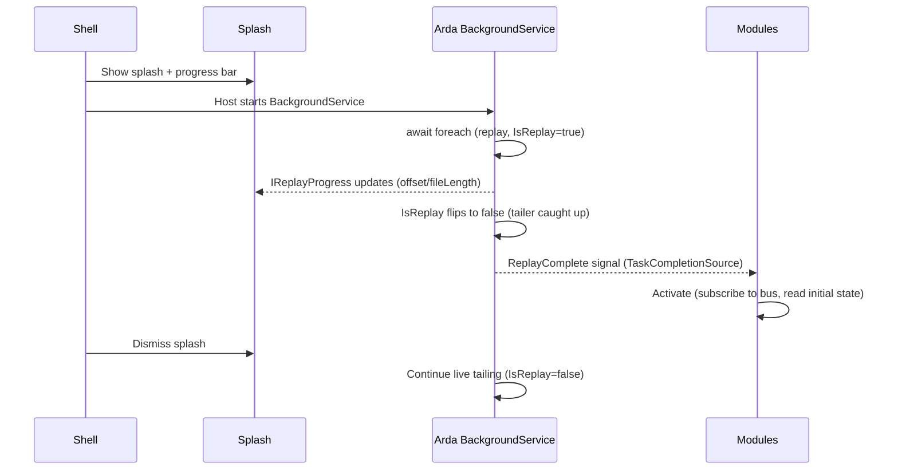

# L2/L3: World Driver & Dispatch

This doc covers two tightly-coupled layers:

- **L2 — World Driver**: the minimal `await foreach` dispatch loop over `ILogLineSource`.
- **L3 — Dispatch**: verb-keyed routing, positional arg tokenizing, domain event emission.

They share a project (`Arda.Dispatch`) because the driver calls the dispatch table directly and no consumer needs one without the other.

This doc also covers **Arda.Hosting** — the DI/lifecycle package that wires L0–L3 together and owns the replay-then-signal startup model.

Cross-reference: [`dispatch-and-composition.md`](dispatch-and-composition.md) defines the invariants. This doc is the implementation design.

---

## L2: World Driver

### What L2 is

The thinnest possible bridge between `ILogLineSource` (L0/L1 output) and the `DispatchTable` (L3). It is:

1. An `await foreach` loop pulling `LogLine` from the source
2. Verb extraction on each line's `.Log` span
3. A `DispatchTable.Dispatch(verbSpan, argsSpan, metadata)` call

No clock advancement, no seed frames. Those concerns are handled naturally:
- `IsReplay` is already on `LogLineMetadata` (stamped at L1 by the coordinator)
- Clock is derivable from `LogLineMetadata.Timestamp` by any consumer that needs it
- Cold-start state is delivered by replaying the full log in source order — no reverse-scan seed hacks

### What L2 replaces

The following existing types are deprecated by Arda's L2+L3:

- `IWorld` (merger-based contract in `src/Mithril.WorldSim.Core/IWorld.cs`)
- `IWorldEventBus` / `Frame<T>` (in `src/Mithril.WorldSim.Core/`)
- `PlayerWorld` / `ChatWorld` (the merger implementations)
- `IFrameProducer<T>`, `IFolder<T>`, `IComposer`
- `WorldMergerStartHostedService`

### `IWorldDriver` contract

```csharp
public interface IWorldDriver
{
    Task RunAsync(CancellationToken ct);
}
```

### `WorldDriver` implementation

```csharp
internal sealed class WorldDriver : IWorldDriver
{
    private readonly ILogLineSource _source;
    private readonly DispatchTable _dispatch;

    public async Task RunAsync(CancellationToken ct)
    {
        await foreach (var line in _source.Lines(ct))
        {
            var parsed = VerbExtractor.Parse(line.Log.AsSpan());
            _dispatch.Dispatch(parsed, line.Log, line.Metadata);
        }
    }
}
```

That is the entire L2 implementation. One class, one method, four lines of body.

### `IDomainEventPublisher` / `IDomainEventSubscriber` (replacement for `IWorldEventBus`)

The bus surface is split into two narrow halves so handlers can only publish and
modules can only subscribe — the type system enforces the no-back-edge rule.

```csharp
public interface IDomainEventSubscriber
{
    IDisposable Subscribe<T>(Action<T> handler) where T : struct;
}

public interface IDomainEventPublisher
{
    void Publish<T>(T domainEvent) where T : struct;
}
```

Both halves resolve to the same `DomainEventBus` singleton (one bus per
pipeline). The composite `IDomainEventBus` interface still exists but is
internal to `Arda.Dispatch` — no external code references it.

Key differences from the legacy `IWorldEventBus`:
- No `Frame<T>` wrapper — domain events carry their own `LogLineMetadata` field
- `Publish` is exposed (handlers call it directly)
- Constraint `where T : struct` enforces value-type events (no heap allocation for the event envelope)

### Data flow



### What L2 does NOT include

- Hosting/lifecycle (owned by Arda.Hosting — see below)
- Per-handler try/catch containment (can be added inside `DispatchTable.Dispatch` when needed)
- Clock/time tracking (consumers derive time from `LogLineMetadata.Timestamp`)
- Backpressure / batching (not needed for synchronous single-thread dispatch)

---

## L3: Dispatch

Design for the verb-keyed dispatch layer. Sits between L2 (world driver) and the state machines. This layer owns:

1. Verb extraction from `LogLine.Log`
2. Handler registry (verb → handler list)
3. Frame deserialization (positional arg tokenizing on span)
4. Emission of domain events via `IDomainEventPublisher`

## Verb extraction

The `LogLine.Log` field (timestamp prefix already stripped at L1) has one of several structural shapes:

```
LocalPlayer: Process<Verb>(<args>)
LocalPlayer: ProcessAddPlayer(<big positional list>)
LOADING LEVEL <AreaKey>
!!! Initializing area! (<id>): <AreaKey>
Download appearance loop @<model>(<params>)
```

Extraction operates on `ReadOnlySpan<char>` (sliced from the existing `LogLine.Log` string — zero allocation):

```csharp
// Pseudocode — actual impl will be in Arda.Dispatch
static ReadOnlySpan<char> ExtractVerb(ReadOnlySpan<char> log)
{
    // Most common: "LocalPlayer: Process<Verb>(<args>)"
    const string prefix = "LocalPlayer: ";
    if (log.StartsWith(prefix))
    {
        var afterPrefix = log[prefix.Length..];
        var parenIdx = afterPrefix.IndexOf('(');
        return parenIdx > 0 ? afterPrefix[..parenIdx] : afterPrefix;
    }

    // System lines: "LOADING LEVEL", "!!! Initializing area!"
    var spaceIdx = log.IndexOf(' ');
    if (spaceIdx > 0)
    {
        // For multi-word verbs, use first token as discriminator
        // then the handler parses the rest
        ...
    }
}
```

The extracted verb span is used directly as the `FrozenDictionary` lookup key via `GetAlternateLookup<ReadOnlySpan<char>>()`. No string allocated for the verb itself.

### Verb taxonomy (from log corpus)

| Shape | Example | Verb key | Frequency |
|---|---|---|---|
| `LocalPlayer: Process<V>(...)` | `ProcessDeleteItem(12345)` | `ProcessDeleteItem` | ~80% of dispatched lines |
| `LocalPlayer: <V>(...)` | — | rare, observed in some status lines | |
| Bare system line | `LOADING LEVEL AreaSerbule` | `LOADING_LEVEL` (synthetic) | rare, session boundaries |
| Bang-prefix | `!!! Initializing area! (502934): AreaSerbule` | `InitializingArea` (synthetic) | rare, one per zone |

The `Process*` verbs are the bulk. The synthetic keys for system lines are registered manually in the handler table.

## Handler registry

```csharp
// Built once at startup, frozen for O(1) span-based lookup
FrozenDictionary<string, IReadOnlyList<IFrameHandler>> _handlers;

// Lookup path (zero alloc):
var verbSpan = ExtractVerb(logLine.Log.AsSpan());
var lookup = _handlers.GetAlternateLookup<ReadOnlySpan<char>>();
if (lookup.TryGetValue(verbSpan, out var handlerList))
{
    var args = ExtractArgs(logLine.Log.AsSpan(), verbSpan.Length);
    foreach (var handler in handlerList)
        handler.Handle(args, logLine.Log, logLine.Metadata);
}
// else: unhandled verb — observable diagnostic, zero alloc
```

### Handler interface

```csharp
interface IFrameHandler
{
    /// <summary>
    /// Process a dispatched line. The args span contains everything after
    /// the opening '(' (or the discriminator for system lines). The handler
    /// tokenizes positionally on the span and emits domain events.
    /// sourceLog is the backing LogLine.Log string — needed by passthrough
    /// handlers to produce ReadOnlyMemory<char> slices without allocation.
    /// </summary>
    void Handle(ReadOnlySpan<char> args, string sourceLog, LogLineMetadata metadata);
}
```

Handlers receive the args as a span — they never receive a `string` for the verb or the full line. This enforces the allocation discipline: the handler decides what to materialize.

### Registration

```csharp
static class PlayerWorldHandlers
{
    public static FrozenDictionary<string, IReadOnlyList<IFrameHandler>> Build(
        /* SM instances, reference data for interning */)
    {
        var registry = new Dictionary<string, List<IFrameHandler>>();

        // Multi-consumer verbs: multiple handlers
        Register(registry, "ProcessDeleteItem", inventorySm, npcInteractionSm);
        Register(registry, "ProcessStartInteraction", npcInteractionSm, inventorySm);

        // Single-consumer passthrough verbs
        Register(registry, "ProcessSetPetOwner", gardenPassthrough);
        Register(registry, "ProcessUpdateDescription", gardenPassthrough);

        // Shared infrastructure
        Register(registry, "ProcessLoadSkills", playerSm);
        Register(registry, "ProcessUpdateSkill", playerSm);
        Register(registry, "ProcessAddItem", inventorySm);

        return registry.ToFrozenDictionary(
            kvp => kvp.Key,
            kvp => (IReadOnlyList<IFrameHandler>)kvp.Value);
    }
}
```

Registration is a single static method — auditable in one place. Dispatch order within a verb is the list order.

## Positional tokenizer

Most `Process*` verbs follow a consistent grammar: `Process<Verb>(<arg1>, <arg2>, ...)` where args are:
- Integers/longs (entity IDs, instance IDs, counts)
- Doubles (favor values, coordinates)
- Quoted strings (`"NPC_Marna"`, `"Emraell"`)
- Enum-like tokens (`Idle`, `Standing`, `True`)
- Nested structures (`{type=X,raw=Y,...}`, `[id1,id2,...]`)

A general-purpose span tokenizer handles the common patterns:

```csharp
ref struct ArgTokenizer
{
    private ReadOnlySpan<char> _remaining;

    public ArgTokenizer(ReadOnlySpan<char> args) => _remaining = args;

    /// <summary>Skip past the opening '(' if present.</summary>
    public void SkipOpen();

    /// <summary>Read next token as long. Advances past trailing comma/space.</summary>
    public long NextLong();

    /// <summary>Read next token as double. Advances past trailing comma/space.</summary>
    public double NextDouble();

    /// <summary>
    /// Read next quoted string as a span (no allocation).
    /// The caller decides whether to intern or ToString().
    /// </summary>
    public ReadOnlySpan<char> NextQuotedSpan();

    /// <summary>Read next unquoted token as a span.</summary>
    public ReadOnlySpan<char> NextTokenSpan();

    /// <summary>Read a bracketed array [...] as a span.</summary>
    public ReadOnlySpan<char> NextBracketedSpan();

    /// <summary>Read a braced struct {...} as a span.</summary>
    public ReadOnlySpan<char> NextBracedSpan();

    /// <summary>Skip N positional args without parsing.</summary>
    public void Skip(int count);
}
```

This is a `ref struct` (stack-only, no heap). Each `Next*` method advances past the delimiter (`,` + optional space). Handlers compose calls to extract only the positions they need:

```csharp
// ProcessDeleteItem(12345) — Inventory SM handler
void Handle(ReadOnlySpan<char> args, LogLineMetadata metadata)
{
    var tok = new ArgTokenizer(args);
    tok.SkipOpen();
    var instanceId = tok.NextLong();
    _inventorySm.OnItemDeleted(instanceId, metadata);
}

// ProcessStartInteraction(entityId, ?, favor, ?, "NPC_Key") — NPC SM handler
void Handle(ReadOnlySpan<char> args, LogLineMetadata metadata)
{
    var tok = new ArgTokenizer(args);
    tok.SkipOpen();
    var entityId = tok.NextLong();
    tok.Skip(1);  // unknown int
    var favor = tok.NextDouble();
    tok.Skip(1);  // unknown token
    var npcKeySpan = tok.NextQuotedSpan();

    // Intern against reference data — zero alloc for known NPCs
    var npcKey = _npcLookup.TryGetValue(npcKeySpan, out var entry)
        ? entry.Key
        : npcKeySpan.ToString(); // unknown NPC, rare

    _npcSm.OnInteractionStarted(entityId, favor, npcKey, metadata);
}
```

## Domain event emission

State machines emit events onto `world.out`. Two event tiers (see [`dispatch-and-composition.md`](dispatch-and-composition.md) § Event allocation strategy):

### Tier 1: Interpreted events (multi-consumer)

Arda-owned SMs produce semantic domain events with fully typed fields:

```csharp
// Inventory SM emits after correlating add/delete/update sequences
readonly record struct InventoryItemRemoved(
    long InstanceId,
    string InternalName,  // interned from reference data
    LogLineMetadata Metadata);

// NPC SM emits after correlating interaction + delete + favor delta
readonly record struct GiftAccepted(
    string NpcKey,        // interned
    string ItemName,      // interned
    double FavorDelta,
    LogLineMetadata Metadata);
```

### Tier 2: Passthrough frames (single-consumer)

For verbs where only one module cares about the interpretation, Arda emits the deserialized frame verbatim. Free-text fields use `ReadOnlyMemory<char>` to defer string allocation to the consumer:

```csharp
// Garden passthrough — Samwise is the sole consumer
readonly record struct UpdateDescriptionFrame(
    long PlotId,
    ReadOnlyMemory<char> Title,
    ReadOnlyMemory<char> Description,
    ReadOnlyMemory<char> Action,
    double Scale,
    LogLineMetadata Metadata);

readonly record struct SetPetOwnerFrame(
    long EntityId,
    LogLineMetadata Metadata);
```

The `ReadOnlyMemory<char>` slices reference the `LogLine.Log` string. As long as the module processes the event within the dispatch tick (typical — SMs are synchronous), the backing string stays alive. If the module needs to persist a value in its SM state, it calls `.ToString()` on the slice it needs — paying the allocation only when and where it's actually required.

### Passthrough handler pattern

```csharp
sealed class PassthroughHandler<TFrame> : IFrameHandler
    where TFrame : struct
{
    private readonly Func<ReadOnlySpan<char>, LogLineMetadata, string, TFrame> _deserialize;
    private readonly Action<TFrame> _emit;

    public void Handle(ReadOnlySpan<char> args, LogLineMetadata metadata)
    {
        // The source string is needed for ReadOnlyMemory slicing
        var frame = _deserialize(args, metadata, _sourceLog);
        _emit(frame);
    }
}
```

## World.out subscription surface

Modules subscribe to typed events through `IDomainEventSubscriber`; handlers
and composers that need to publish take `IDomainEventPublisher`:

```csharp
public interface IDomainEventSubscriber
{
    IDisposable Subscribe<T>(Action<T> handler) where T : struct;
}

public interface IDomainEventPublisher
{
    void Publish<T>(T domainEvent) where T : struct;
}

// Inside GardenStateMachine (module-owned)
public GardenStateMachine(IDomainEventSubscriber bus)
{
    bus.Subscribe<UpdateDescriptionFrame>(OnDescriptionUpdated);
    bus.Subscribe<SetPetOwnerFrame>(OnPetOwnerSet);
    bus.Subscribe<InteractionStarted>(OnInteractionStarted);
}
```

The publish/subscribe split lets handlers depend on `IDomainEventPublisher` (no temptation to subscribe to their own output) and modules depend on `IDomainEventSubscriber` (no temptation to publish back, see the no-back-edge note in [`dispatch-and-composition.md`](dispatch-and-composition.md)). Both interfaces resolve to the same `DomainEventBus` singleton — there is one bus instance for the whole pipeline.

## String interning at L3

The dispatch layer holds `FrozenDictionary` references for known identifier families:

```csharp
sealed class InternPool
{
    private readonly FrozenDictionary<string, string>.AlternateLookup<ReadOnlySpan<char>> _npcs;
    private readonly FrozenDictionary<string, string>.AlternateLookup<ReadOnlySpan<char>> _items;
    private readonly FrozenDictionary<string, string>.AlternateLookup<ReadOnlySpan<char>> _areas;
    private readonly FrozenDictionary<string, string>.AlternateLookup<ReadOnlySpan<char>> _skills;

    /// <summary>
    /// Constructed from IReferenceDataService after CDN data loads.
    /// Keys are the canonical string instances from the POCO dictionaries.
    /// </summary>
    public InternPool(IReferenceDataService refData) { ... }

    /// <summary>
    /// Try to intern a span against all known identifier families.
    /// Returns the existing string instance if found, null otherwise.
    /// </summary>
    public string? TryIntern(ReadOnlySpan<char> value) { ... }

    /// <summary>
    /// Intern or allocate. Returns existing instance for known identifiers,
    /// calls span.ToString() for unknown values.
    /// </summary>
    public string InternOrAllocate(ReadOnlySpan<char> value)
        => TryIntern(value) ?? value.ToString();
}
```

Handlers call `_pool.TryIntern(npcKeySpan)` before falling through to `.ToString()`. For the hot path (known NPCs, known items, known skills), this is always a cache hit — zero allocation.

## Project structure

Event contracts and state interfaces live in `Arda.Contracts` (one file per type, grouped by source). Dispatch primitives live in `Arda.Dispatch`. Source-specific handlers live in `Arda.World.Player` / `Arda.World.Chat`.

```
Arda.Contracts/
  Arda.Contracts.csproj
  Events/
    Player/                   — one file per event (AreaChanged.cs, InventoryItemAdded.cs, ...)
    Chat/                     — ChatSessionIdentified.cs, ChatInventoryObserved.cs, PlayerChatLine.cs
    Composition/              — SessionEstablished.cs, InventoryItemResolved.cs, NpcStateChanged.cs, SkillProgressionChanged.cs
  State/
    Player/                   — IAreaState, IInventoryState, INpcState, IPlayerState, IPositionState, IMapState, ...
    Chat/                     — IChatSessionState
    Composition/              — IInventoryAccumulatorState, IPlayerProgressionState, INpcStateTracker, ISessionComposer
    Health/                   — IWorldHealthView (replaces legacy LogStreamAttentionSource)
  IDomainEventPublisher.cs    — publish-only half (used by handlers, composers)
  IDomainEventSubscriber.cs   — subscribe-only half (used by modules, composers)

Arda.Dispatch/
  Arda.Dispatch.csproj        — references Arda.Abstractions + Arda.Contracts
  VerbExtractor.cs            — span-based verb extraction from LogLine.Log (closed whitelist, Option A)
  Verbs.cs                    — canonical verb-key constants (Process* + synthetic LOADING_LEVEL / CHAT_*)
  ArgTokenizer.cs             — ref struct positional tokenizer
  SpanHelpers.cs              — shared span utilities
  IFrameHandler.cs            — handler interface
  ILineObserver.cs            — pre-dispatch observer (Calendar, AppearanceObserver)
  DispatchTable.cs            — FrozenDictionary-backed registry, ordered handler lists per verb
  InternPool.cs               — string interning against reference data
  IWorldDriver.cs / WorldDriver.cs
  DomainEventBus.cs           — single singleton implementing both publisher + subscriber

Arda.World.Player/
  PlayerWorldExtensions.cs    — the single auditable point where every handler + line observer is registered
  Internal/                   — Map, Inventory, Player, Npc, Session, Weather, Celestial, Effects, Position, Quest, MapPins, Calendar, Vault (state owners)
                                AddItemHandler, DeleteItemHandler, StartInteractionHandler, DeltaFavorHandler, NpcDeleteItemHandler, UpdateItemCodeHandler, etc. (thin Tier 2 adapters)
                                StateResetHandler (fan-out reset on LOADING_LEVEL)
                                MapScope (composite IMapState projection — not a handler)

Arda.World.Chat/
  ChatWorldExtensions.cs
  Internal/                   — ChatSession, ChatInventory, ChatLine
```

## Unhandled verb policy

When a verb has no registered handler:
- Zero allocation (the verb span is inspected and discarded)
- A counter increments per-verb (observable via diagnostics)
- No error, no log — this is the normal steady state for engine noise that passed L1 classification (e.g., `ProcessClearCursor`, `LoadAssetAsync`)

This means the handler table is opt-in: only verbs that produce domain events need registration. The rest are silently dropped at zero cost. As new verbs are catalogued, handlers are added — the dispatch table grows monotonically.

## Verb extraction is a closed whitelist (design friction)

`VerbExtractor.Parse` is a hand-coded `if`/`else` chain recognizing five line grammars. The dispatch table is open (register a handler, it routes), but the front door to it is closed — every new line grammar requires a code change in `VerbExtractor`, a rebuild of `Arda.Dispatch`, and knowledge of where in the chain to slot it.

### Grammars observed in a real 94K-line session

| Shape | Example | Count | VerbExtractor handles? |
|---|---|---|---|
| `LocalPlayer: Verb(args)` | `ProcessAddItem(...)` | 10,134 | Yes |
| `Download appearance loop @...` | `@Base2-m(sex=m, ...)` | 18,544 | **No** |
| `entity_<id>: Verb(args)` | `OnAttackHitMe(Fish Reel)` | 100 | **No** |
| Bare `Verb(args)` (no prefix) | `ProcessUpdateDescription(...)`, `ProcessEmote(...)` | 986 | **No** |
| System lines | `LOADING LEVEL`, `!!! Initializing area!` | 5 | Yes |
| Engine noise | LoadAssetAsync, IsDoneLoading, ... | ~62,000 | Correctly discarded |

`Download appearance loop` is the *most frequent* structured line type — nearly 2x `LocalPlayer:`. It's only "rare" in terms of current consumer demand (Samwise needs a subset), not pipeline volume. Bare `ProcessUpdateDescription` (919 lines) represents other entities' garden plot updates. `entity_<id>: OnAttackHitMe(...)` is combat data from other entities.

### Structural shapes

On closer inspection the four original shapes collapse into two fundamental structures:

**Shape 1: `[optional entity prefix: ] Verb(args)`**

All of `LocalPlayer:`, `entity_<id>:`, and bare verb lines share the same grammar — an optional entity prefix followed by `Word(stuff)`. Examples:

- `LocalPlayer: ProcessAddItem(...)` — entity = `LocalPlayer`
- `entity_25191066: OnAttackHitMe(...)` — entity = `entity_25191066`
- `ProcessUpdateDescription(25222128, ...)` — no entity prefix
- `ProcessEmote(25216432, ...)` — no entity prefix
- `ClearCursor(SelectionController)` — no entity prefix (engine noise, same grammar)

**Shape 2: System lines**

Everything that doesn't follow the `Verb(args)` pattern. Includes both actionable system lines and engine noise:

- `LOADING LEVEL AreaSerbule` — actionable (zone transition)
- `!!! Initializing area! (502934): AreaSerbule` — actionable (area init)
- `Download appearance loop @Base2-m(sex=m, ...)` — actionable (Samwise)
- `LoadAssetAsync: eq-x-m2-head-0. Status=None.` — engine noise
- `New Network State: Unconnected -> Connecting)` — engine noise

This means a structurally-aware extractor could recognize Shape 1 generically — scan for the first `(`, extract the word before it as the verb, optionally strip an entity prefix ending in `: `. The entity prefix becomes metadata on the `ParsedVerb`, not a gating condition. `ClearCursor` has no handler, so it's silently dropped at zero cost just like today. System lines (Shape 2) remain a small fixed set of pattern-matched cases.

### Three parallel entry points today

The current architecture has three mechanisms for line consumption, which compounds the friction:

1. **`VerbExtractor.Parse`** → `DispatchTable` — closed whitelist, handles Shape 1 (`LocalPlayer` only) and two Shape 2 system lines.
2. **`ILineObserver.Observe`** — sees every line's `LogLineMetadata` but NOT the log content. Calendar uses this for timestamp tracking.
3. **Ad-hoc workarounds** — the module migration plan proposes widening `ILineObserver` or inventing a new interface for `Download appearance loop` because neither existing path fits.

### Design options (future)

**A. Keep the whitelist, expand incrementally.** Add branches for each new grammar. The game's log format is externally fixed (PG developers control it), so the set is finite. The explicitness is a feature — one file shows every supported shape.

**B. Make the extractor a registered chain.** Each grammar is an `IVerbMatcher` that tries to extract a verb+args from the line span. `LocalPlayer:` is the first (hot) matcher. Others are registered at DI time alongside their handlers. The dispatch table and the extraction table grow together.

**C. Unify observer + dispatch.** Replace `VerbExtractor` + `DispatchTable` + `ILineObserver` with a single ordered `ILineProcessor` list. Calendar becomes a line processor. `LocalPlayer:` extraction becomes a line processor. Each gets the full line span and decides whether to handle it.

**D. Structural recognition for Shape 1, fixed patterns for Shape 2.** `VerbExtractor` recognizes the generic `[entity: ] Verb(args)` structure in one pass — scan for `(`, extract the word before it, optionally strip an entity prefix. The entity prefix is surfaced as metadata on `ParsedVerb`. System lines remain a small fixed set of prefix checks. This preserves the single-file auditability for the small set of system patterns while making Shape 1 fully open — adding a handler for `ProcessEmote` or `entity_<id>: OnAttackHitMe` requires only a dispatch table registration, no extractor change.

Trade-off axis: **auditability vs. extensibility**. Option A keeps one auditable file but requires touching `Arda.Dispatch` for every new grammar. Options B/C let registrations bring their own grammar but lose the single-file view. Option D is a middle ground — Shape 1 is structurally open, Shape 2 remains a curated list.

Tracked in [#803](https://github.com/moumantai-gg/mithril/issues/803). No change needed before the current module migration lands — the migration plan works around this via `ILineObserver` for `AppearanceLoop`. Revisit when a second non-`LocalPlayer:` grammar needs handler registration.

---

## Relationship to the world-sim rethink

[`world-sim-single-source-rethink.md`](../../world-sim-single-source-rethink.md) identified the correct problem: the N-way merger inside each world is structurally wrong because each world is single-source. Its proposed solution — `IFrameTransform<TEnvelope, TPayload>` (synchronous, source-order, no merger) — was a stepping stone. This L3 design absorbs the critique and goes further:

| Rethink proposal | Arda L3 |
|---|---|
| Replace merger with direct dispatch over source order | Adopted. L2 is the `await foreach` dispatch loop over `ILogLineSource`. |
| `IFrameTransform` returns typed `Frame<T>?` to a `Folder` | Eliminated. Handler receives args as span, owns the SM state directly, emits events. No intermediate frame type, no folder indirection. |
| Folders apply frames and emit change events | Handler IS the state owner. "Apply" and "emit" are one step inside the handler. |
| Composers observe folder changes | Survives as the composition pipeline (L4) subscribing to `world.out` events. |
| `IWorldEventBus` typed pub-sub | Survives as the module subscription surface. |

**What the rethink got right** (and Arda inherits):
- Single-source doesn't need N-way merge — direct dispatch in source order
- Per-transform containment (try/catch + diagnostics) — lives in the L2 dispatch loop
- Replay determinism from source order — guaranteed by `ILogLineSource` structural ordering
- Mode flip from `IsReplay` on the envelope metadata — no separate `ReachedLive` signal per producer
- Silent transforms are fine (return null / no handler for verb) — zero-alloc discard

**What Arda subsumes:**
- The typed `Frame<T>` intermediate is unnecessary when the handler already owns the state it would "apply" to. Materializing a frame struct only to hand it to a folder that calls `.Apply(frame)` on the same state machine is an allocation + indirection for no consumer benefit.
- `IFolder<T>` and its `Apply` pattern collapse into the handler. The handler tokenizes the args, updates its state, and emits domain events in one synchronous step.
- The 5-phase migration plan in the rethink doc is obviated — Arda replaces the entire pipeline wholesale rather than migrating producers one-by-one into transforms.

The rethink doc remains valuable as **rationale trail** (why the merger is wrong), but its proposed interfaces (`IFrameTransform`, the preserved folder/composer chain) are superseded by verb-keyed dispatch to stateful handlers.

---

## Arda.Hosting

Pure hosting package. References `Arda.Dispatch`, `Arda.Ingest`, `Microsoft.Extensions.Hosting`. No WPF dependency.

### Responsibilities

1. **DI composition** — a single `AddArda(this IServiceCollection, ArdaOptions)` extension that wires:
   - `PlayerLogSource` + `ChatLogSource` (from Arda.Ingest)
   - `DispatchTable` + handler registrations (from Arda.Dispatch)
   - `DomainEventBus` implementation (registered as `IDomainEventPublisher` + `IDomainEventSubscriber`)
   - `IWorldDriver` instances (one per source family)
   - `BackgroundService` wrappers that call `IWorldDriver.RunAsync`

2. **Replay-ready signal** — a `TaskCompletionSource` per driver that completes when the first `IsReplay = false` line is processed. Modules gate activation on this.

3. **Progress reporting** — an `IReplayProgress` interface the Shell can bind to for splash screen display.

### Startup model (replay-then-signal)



### Key types

```csharp
public record ArdaOptions(
    string LogDirectory,
    string? ChatLogDirectory = null,
    TimeSpan? PollInterval = null);

public interface IReplayProgress
{
    double PlayerProgress { get; }
    double ChatProgress { get; }
    Task ReplayComplete { get; }
}
```

### Cold-start resolution

No seed-frame reverse-scans. No `TryBuildSeedFrame`. The full replay delivers all initial state in source order:
- `LOADING LEVEL AreaSerbule` arrives naturally during replay (it's in the log before `ProcessAddPlayer`)
- `ProcessLoadSkills(...)` arrives during replay (fires at login + every zone change)
- `ProcessAddItem(...)` for inventory arrives during replay

Modules that need "current state at activation" simply read the SM state after `ReplayComplete` fires. The handler SMs have already processed every historical event by that point.

This eliminates the entire class of cold-start bugs (area not set, skills not loaded, inventory empty at startup) because there is no window where state is partially initialized.

### Project structure

```
Arda.Hosting/
  Arda.Hosting.csproj
  ArdaOptions.cs
  ArdaServiceCollectionExtensions.cs   -- AddArda()
  IReplayProgress.cs
  Internal/
    PlayerWorldService.cs              -- BackgroundService: PlayerLogSource → WorldDriver
    ChatWorldService.cs                -- BackgroundService: ChatLogSource → WorldDriver
    ReplayProgress.cs                  -- IReplayProgress impl, fires TaskCompletionSource
```

### Shell integration

```csharp
services
    .AddMithrilReferenceData(referenceCacheDir)
    .AddArda(new ArdaOptions(logDir))
    .AddMithrilModules(moduleLog);
```

The existing `AddPlayerWorld()` / `AddChatWorld()` / `AddWorldMergerStart()` calls are removed.

---

## Cross-references

- [`dispatch-and-composition.md`](dispatch-and-composition.md) — architectural invariants, ownership boundary, event allocation tiers
- [`log-source.md`](log-source.md) — L0/L1 design, `LogLine`/`LogLineMetadata` shape
- [`simulator-design.md`](simulator-design.md) — frame types, world pipes, suggested SM catalogue
- [`../../world-sim-single-source-rethink.md`](../../world-sim-single-source-rethink.md) — historical critique of the merger pattern. Rationale absorbed; proposed `IFrameTransform` shape superseded by this design.
- [`../../Mithril.Shared/Reference/log-patterns.json`](../../src/Mithril.Shared/Reference/log-patterns.json) — existing regex catalog (migration checklist for L3 handlers)
- [wiki: Player-Log-Signals](https://github.com/moumantai-gg/mithril/wiki/Player-Log-Signals) — log grammar reference, timestamp contract, session boundaries
