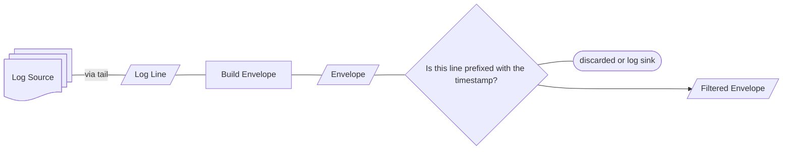

# Log Source
Character session boundary signals found in the wiki.

## Player
* Split over two files. 
* Should expose both logs.
* Log line sequence should be derived from where it was read within the combined log
    * could leverage size in bytes of current and previous log
* Lasts from game start to shutdown

On launch:
    1. Check if Player.log exists. If not, return.
    2. Check if Player-prev.log exists. If it does, delete it.
    3. Rename Player.log into Player-prev.log.
    4. Create Player.log

### Player.log
The most recent logs. Generated when Project Gorgon is launched. Can contain more than one markers for a character session.

### Player-prev.log
The log from the previous launch session.

### Questions
* Because the game creates a new Player.log every time, is there ever a need to read Player-prev.log?
* Can the log rotate while the game is running?
* Strip the timestamp at the log source?

## Chat
Split over many files.

# Outputs
```csharp
record LogLine(string Log, LogLineMetadata Metadata, string? Raw = null);
```
A structured class containing the text tailed from log.

## Metadata
We attach some metadata to the output of the log source.

```csharp
struct LogLineMetadata 
{
    /// <summary>
    /// The timestamp from the line itself, if available
    /// </summary>
    DateTimeOffset? timestamp;
    
    /// <summary>
    /// The timestamp from when the line was read/tailed
    /// </summary>
    DateTimeOffset readOn;

    /// <summary>
    /// Monotonic sequence
    /// </summary>
    long sequence;

    /// <summary>
    /// Is this replay?
    /// </summary>
    bool isReplay;
}
```

## Log Pipeline

