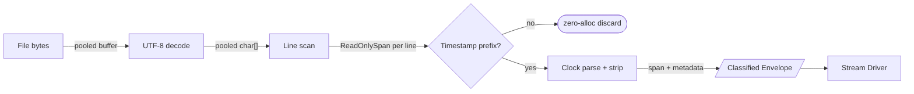

# Log Source
Character session boundary signals found in the wiki.

This component is responsible for reading raw log data from game files, parsing it into structured `LogLine` objects, and ensuring a deterministic, ordered stream of events for the simulator.

## Processing model

### Span-based tokenizing (no regex)

The pipeline operates on `ReadOnlySpan<char>` from L0 through L3. File bytes are decoded into a pooled `char[]` buffer (`ArrayPool<char>.Shared`). Lines are identified as span slices within that buffer — no per-line string allocation until a state machine needs to persist data.

Flow per batch:
1. Tailer reads new bytes into a pooled byte buffer.
2. UTF-8 decode into a pooled char buffer (one allocation, reused across polls).
3. Line boundaries found by scanning for `\n`. Each line is a `ReadOnlySpan<char>`.
4. Classification on the span: does it match `[dd:dd:dd] ` prefix? If no — discard (zero alloc). If yes — proceed.
5. Clock parses timestamp from the span, returns the `DateTimeOffset` and consumed prefix length.
6. L1 slices past the prefix → the stripped game-event text, still a span.
7. Verb extraction at L3: scan for `:` then `(` on the span. `FrozenDictionary.GetAlternateLookup<ReadOnlySpan<char>>()` does the handler lookup without allocating a string for the key.
8. Only when a handler needs to persist data does `.ToString()` allocate the final string.

Noise lines (engine stack traces, asset loading, Unity diagnostics) — which constitute ~70–90% of lines during startup/loading — never allocate.

### String interning via reference data

The CDN reference data (`IReferenceDataService`) already holds dictionaries keyed by the same identifiers that appear in log lines — area keys, item internal names, skill keys, NPC keys, ability internal names. These dictionary keys are long-lived string instances (app lifetime). Instead of allocating new strings from spans, transforms can look up the canonical instance:

```csharp
// FrozenDictionary built once from reference data at startup
var lookup = frozenAreas.GetAlternateLookup<ReadOnlySpan<char>>();
if (lookup.TryGetValue(lineSpan[afterVerb..], out var entry))
    return entry.Key; // existing string instance, zero allocation
```

`FrozenDictionary.GetAlternateLookup<ReadOnlySpan<char>>()` enables the lookup directly on the span — no string allocated even for the lookup key. If the value exists in reference data, the transform uses the dictionary key as the persisted string. If not (runtime-unique values like entity IDs or player names), it falls through to a normal `.ToString()`.

**Internable** (appears in reference data):
- Area keys (`AreaSerbule`) — from `Areas` dictionary
- Item internal names — from `ItemsByInternalName`
- Skill keys (`Meditation`, `Sword`) — from `Skills`
- NPC keys (`NPC_Marna`) — from `Npcs` / `NpcsByInternalName`
- Ability internal names (`Sword1`) — from `AbilitiesByInternalName`

**Not internable** (runtime-unique, not in reference data):
- Entity instance IDs (`entity_4366965`)
- Numeric values, coordinates
- Player names
- Chat message text

This avoids the problems of `string.Intern()` (permanent GC root, unbounded growth) while achieving the same deduplication for the high-frequency identifiers that repeat across thousands of log lines per session.

## Player
* Split over two files. 
* Should expose both logs.
* Log line sequence should be derived from where it was read within the combined log
    * could leverage size in bytes of current and previous log
* Lasts from game start to shutdown

### Rotation
### Player Log Rotation
When Project Gorgon launches, it performs the following operations:
    1. Check if Player.log exists. If not, return.
    2. Check if Player-prev.log exists. If it does, delete it.
    3. Rename Player.log into Player-prev.log.
    4. Create Player.log

Mithril needs to account for this. Project Gorgon can replace the file we're tailing if the game is restarted.

### Player.log
### Player.log (Current Session)
The most recent logs. Generated when Project Gorgon is launched. Can contain more than one markers for a character session.

### Player-prev.log
### Player-prev.log (Previous Session)
The log from the previous launch session. Mithril can look behind Player.log, if required.

### Questions
* Because the game creates a new Player.log every time, is there ever a need to read Player-prev.log?
    *   **Answer**: Yes, potentially. If Mithril needs to analyze events that occurred *just before* a game restart (e.g., a crash, or a short play session followed by a restart), `Player-prev.log` contains that data. Also, if Mithril itself restarts, it might need to resume from the *end* of the previous session, which could be in `Player-prev.log` if the game had already rotated it. It's safer to assume it *might* be needed and provide the option. The `isReplay` flag helps distinguish.
* Can the log rotate while the game is running?
    *   **Answer**: Based on the description "When Project Gorgon launches, it performs the following operations...", it strongly implies rotation *only happens at launch*. If it *could* rotate mid-game, the tailing strategy would need to be even more robust (e.g., checking file handles, inode numbers). For now, we'll assume it only happens at launch, simplifying the tailing logic to detect file changes upon restart.
* Strip the timestamp at the log source?
    *   **Answer**: Yes. The `LogLine.Log` contains the raw content *after* the timestamp prefix. The parsed timestamp goes into `LogLineMetadata.timestamp`. The clock (L0) parses the timestamp and reports the consumed prefix length; L1 slices past it.

## Chat
### Chat Log Rotation
Chat logs are rotated using the pattern `Chat-yy-mm-dd.log`. 
A single character session may span across multiple files (e.g., during a midnight rollover). Because the rotation is strictly chronological based on the filename, reading these files in order is sufficient to maintain a deterministic event stream.

# Metadata
## Timestamps
Not every line in a log is valid input for the world sim. Valid input will be prefixed by `[hh:mm:ss] `. For the player logs, this is a UTC time. For chat logs, this is the player's local time. This will be offered as a `DateTimeOffset` in a log line's metadata. We will also offer the instant the log was read.

## IsReplay
We must keep track of when we have stopped processing log lines from before Mithril was running. `isReplay` flips exactly once per stream lifetime (true → false, never reverts). The source coordinator signals "caught up" when the tail offset reaches EOF and no more historical files remain.

## Ordering (internal)

Ordering within a log family is an internal concern of the source coordinator — not part of the public `LogLine` contract. The coordinator uses structural byte-offset arithmetic for:
- **Resumption**: checkpoint current position, resume after restart.
- **Deduplication**: skip lines already processed on prior run.
- **Determinism**: within a family, files are read in structural order (Player-prev before Player; Chat files in filename-date order). Source order is the authoritative sequence.

No downstream consumer inspects byte offsets or file positions. Cross-world correlation at the composition layer (L4) uses `timestamp` and `readOn` only.

# Outputs
```csharp
record LogLine(string Log, LogLineMetadata Metadata, string? Raw = null);
```
A structured record containing the stripped text tailed from log.

## Metadata
Minimal metadata attached at the L0/L1 boundary. No structural position data leaks to consumers.

```csharp
struct LogLineMetadata 
{
    /// <summary>
    /// The timestamp extracted from the line prefix, if present.
    /// </summary>
    DateTimeOffset? Timestamp;
    
    /// <summary>
    /// Wall-clock instant when the tailer captured this batch.
    /// Used for cross-world correlation tiebreaking at the composition layer.
    /// </summary>
    DateTimeOffset ReadOn;

    /// <summary>
    /// True while processing historic data from before Mithril was running.
    /// Flips to false exactly once per stream lifetime.
    /// </summary>
    bool IsReplay;
}
```

## Log Pipeline



Classification is permissive: lines matching known non-timestamped system patterns (e.g., server connection identity) may also be promoted to envelopes as the log grammar is catalogued. Unrecognized non-timestamped lines are discarded at zero cost (span inspected, never allocated).